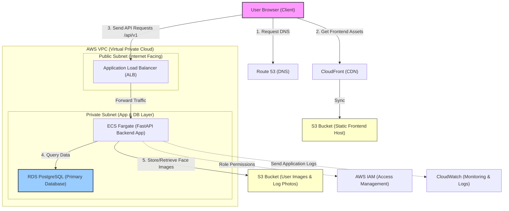

# AWS System Architecture Diagram

This document presents the system architecture for deploying the **Fav_Web** application (comprising Frontend React/Vite, FastAPI Backend, SQLite-to-RDS PostgreSQL Database, and Face Recognition AI) on AWS.

## Architecture Diagram

## Communication Flow Explanation

### 1. Static Frontend Delivery
* **Amazon CloudFront** acts as the Content Delivery Network (CDN) caching the compiled frontend files (HTML, CSS, JS, images) closest to the user.
* The source of these files is an **Amazon S3 Bucket** configured for static website hosting.

### 2. API Traffic routing
* All API requests targeting `/api/v1/*` are sent to the **Application Load Balancer (ALB)**.
* The ALB terminates SSL/TLS certificates and distributes traffic to active containers.

### 3. Application Execution (FastAPI Backend & AI Model)
* The FastAPI backend is packaged as a Docker image and runs on **AWS ECS Fargate**.
* Fargate is serverless, meaning AWS manages the underlying server infrastructure, scaling the containers based on CPU and Memory usage.
* The face recognition inference (using the AI model in `backend/ai_core`) executes directly within the container instance.

### 4. Relational Database Layer
* While development uses local SQLite (`app.db`), production uses **Amazon RDS (PostgreSQL/MySQL)** inside a private subnet.
* This ensures data safety, automated backups, and database replication/scaling.

### 5. Media & Logs Storage
* User images uploaded during enrollment and photos captured from webcam logs are stored securely in an **Amazon S3 Bucket (Storage)** instead of the container's local file system. This allows backend containers to remain stateless and scale horizontally.
