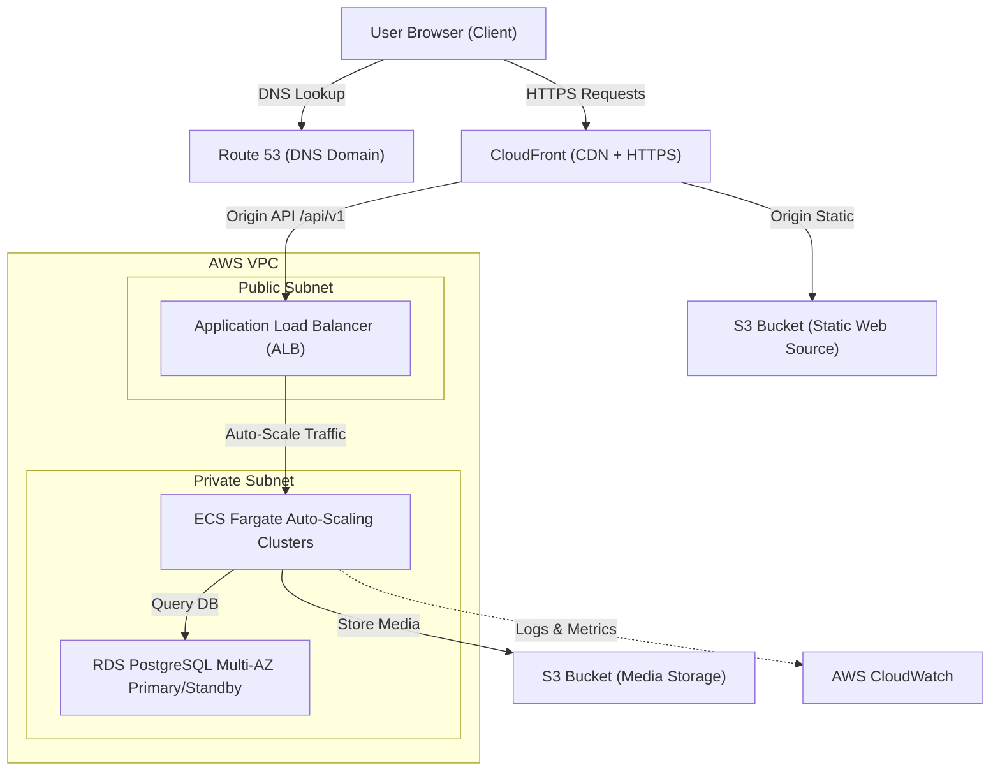

# AWS System Architecture Diagram - Fav Web Portal

Tài liệu này mô tả chi tiết Kiến trúc Hệ thống Điện toán Đám mây **Amazon Web Services (AWS)** cho ứng dụng **Fav Web Portal** (Hệ thống Cổng thông tin đa phương tiện tích hợp AI Nhận diện khuôn mặt Face ID).

---

## 1. Kiến trúc Thực tế Triển khai (Actual Workshop Architecture)

Dưới đây là sơ đồ kiến trúc thực tế được triển khai thành công trong bài thực hành (Workshop) của chương trình FCAJ:

```mermaid
graph TB
    %% Nodes
    User["User Browser (Client)"]
    
    subgraph S3Layer ["AWS S3 Static Web Layer"]
        S3Frontend["S3 Bucket: fav-web-frontend-bucket<br>(Static Website Hosting)"]
    end
    
    subgraph VPC ["AWS VPC (Virtual Private Cloud)"]
        subgraph PublicSubnet ["Public Subnet (Internet Facing)"]
            EC2["EC2 Instance (Ubuntu 22.04 LTS)<br>Docker Container: backend-service (Port 80:8000)<br>FastAPI + AI Face Model"]
        end
        
        subgraph PrivateSubnet ["Database Layer"]
            RDS["AWS RDS PostgreSQL / SQLite Volume"]
        end
    end
    
    S3Storage["S3 Bucket: fav-web-storage-bucket<br>(User Photos, Log Captures & .npy Embeddings)"]
    IAM["AWS IAM (Access Roles & Keys)"]
    CloudWatch["AWS CloudWatch<br>(Log Group /fav-web/backend & CPU Alarm)"]

    %% Connections
    User -->|1. HTTP Get Static Web| S3Frontend
    User -->|2. REST API /api/v1 (JSON/Auth)| EC2
    
    EC2 -->|3. Query & Persist Data| RDS
    EC2 -->|4. Upload/Download Media & Vectors| S3Storage
    
    EC2 -.->|SDK boto3 Permissions| IAM
    EC2 -.->|Stream Logs via Watchtower| CloudWatch

    %% Styling
    style User fill:#f9f,stroke:#333,stroke-width:2px
    style S3Frontend fill:#ffc,stroke:#333,stroke-width:2px
    style EC2 fill:#bbf,stroke:#333,stroke-width:2px
    style RDS fill:#9cf,stroke:#333,stroke-width:2px
    style S3Storage fill:#ffc,stroke:#333,stroke-width:2px
    style CloudWatch fill:#fcf,stroke:#333,stroke-width:1px
```

### Chi tiết Luồng xử lý Kỹ thuật (Communication Flow):

1. **Static Frontend Hosting (Amazon S3):**
   - Ứng dụng React/Vite được đóng gói tối ưu (`dist/`) và đẩy lên **Amazon S3 Bucket** với tính năng *Static Website Hosting*.
   - Trình duyệt Client tải trực tiếp HTML, CSS, JS bundle từ URL S3 Bucket.

2. **API Backend & AI Processing (Amazon EC2 + Docker):**
   - Các yêu cầu HTTP REST API (`/api/v1/*`) từ trình duyệt được gửi trực tiếp tới địa chỉ IP Public của **Amazon EC2 Instance** (Ubuntu).
   - Máy chủ EC2 chạy một **Docker Container** (`backend-service`) vận hành Python FastAPI + Uvicorn server.
   - Thuật toán AI trích xuất vector khuôn mặt (`facenet-pytorch`/`insightface`) và RAM Caching được thực thi trực tiếp bên trong Container.

3. **Data & Storage Layer (AWS RDS & Amazon S3 Storage):**
   - Dữ liệu quan hệ (Người dùng, Bài viết, Nhạc, Game, Log) được lưu trữ tại **AWS RDS PostgreSQL** (hoặc SQLite Persist Volume Mount).
   - Ảnh đại diện, ảnh webcam chụp từ Face ID và các tệp numpy vector `.npy` được tự động tải lên **Amazon S3 Storage Bucket** thông qua thư viện `boto3`.

4. **Security & Monitoring (CORS, CSP, IAM & CloudWatch):**
   - **Bảo mật:** Sử dụng cơ chế JWT Dual Authentication (HttpOnly Cookie + Bearer Token Fallback) kết hợp CORS Whitelist và CSP Meta tag.
   - **Giám sát:** Module `watchtower` gửi log thời gian thực về **AWS CloudWatch Logs** (`/fav-web/backend`) và cấu hình **CloudWatch Alarm** cảnh báo khi CPU EC2 vượt ngưỡng 80%.

---

## 2. Mô hình Mở rộng Sản xuất (Target Production Architecture)

Khi ứng dụng mở rộng cho lượng người dùng lớn trong môi trường Production, hệ thống có thể nâng cấp lên mô hình Serverless / Container Orchestration hoàn chỉnh:

```mermaid
graph TB
    User["User Browser (Client)"]
    Route53["Route 53 (DNS Domain)"]
    CloudFront["CloudFront (CDN + HTTPS)"]
    S3Frontend["S3 Bucket (Static Web Source)"]
    ALB["Application Load Balancer (ALB)"]
    
    subgraph VPC ["AWS VPC"]
        subgraph PublicSubnet ["Public Subnet"]
            ALB
        end
        subgraph PrivateSubnet ["Private Subnet"]
            ECS["ECS Fargate Auto-Scaling Clusters"]
            RDS["RDS PostgreSQL Multi-AZ Primary/Standby"]
        end
    end
    
    S3Storage["S3 Bucket (Media Storage)"]
    CloudWatch["AWS CloudWatch"]

    User -->|DNS Lookup| Route53
    User -->|HTTPS Requests| CloudFront
    CloudFront -->|Origin Static| S3Frontend
    CloudFront -->|Origin API /api/v1| ALB
    ALB -->|Auto-Scale Traffic| ECS
    ECS -->|Query DB| RDS
    ECS -->|Store Media| S3Storage
    ECS -.->|Logs & Metrics| CloudWatch
```

---

## 3. Bảng Tổng hợp Dịch vụ AWS Sử dụng

| Dịch vụ AWS | Vai trò trong Hệ thống | Ghi chú Triển khai |
| --- | --- | --- |
| **Amazon S3** | Static Website Hosting & Object Storage | `fav-web-frontend-bucket` & `fav-web-storage-bucket` |
| **Amazon EC2** | Máy chủ Virtual Server chạy Backend Docker | Ubuntu 22.04 LTS, Docker Engine, Port 80/8000 |
| **Amazon RDS** | Relational Database Managed Service | PostgreSQL DB Instance (Free Tier) |
| **Amazon CloudWatch** | Giám sát Log & Cảnh báo tài nguyên | Log Group `/fav-web/backend` & CPU Metric Alarm |
| **AWS IAM** | Quản lý Quyền truy cập & Security Keys | Access Keys & Policy S3/CloudWatch Access |
